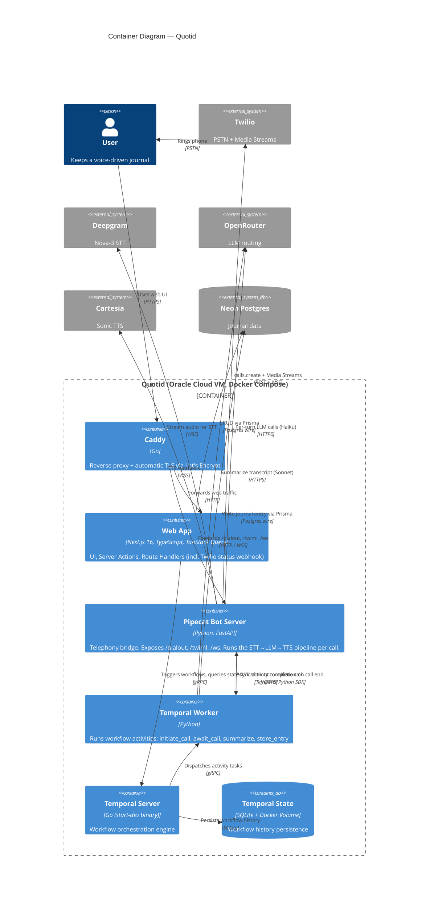

# C4 — Container Diagram

The internals of Quotid: five containers on one Oracle Cloud VM, plus the external SaaS dependencies.

## Design notes

- **Next.js is a single container, not split into frontend + API.** Next.js 16 App Router combines UI (Server Components + Client Components), mutations (Server Actions), and HTTP endpoints (Route Handlers) in one runtime. Splitting into a dedicated Node API server would create redundant types and an extra container for no gain at this scale.
- **Two callers into Pipecat.** The Temporal Worker hits `POST /dialout` to initiate a call; Twilio hits `GET /twiml` and the `/ws` WebSocket as part of call setup. Both route through Caddy; only `/ws` and `/twiml` are publicly reachable (Twilio needs them); `/dialout` can be restricted to localhost / Docker network via Caddy matcher.
- **Pipecat signals completion back to Temporal directly** using the Temporal Python SDK's `get_async_activity_handle(...).complete(payload)` call. The worker's `await_call` activity is registered with `raise_complete_async()` and unblocks when Pipecat reports. A Twilio `statusCallback` webhook into the Next.js app is a watchdog in case Pipecat crashes mid-call — it signals the workflow to time out gracefully.
- **Temporal Server uses `temporal server start-dev`** with a Docker volume holding SQLite state. This is the MVP choice; switching to Temporal Cloud is a config change (no architecture change).
- **Neon stays external.** Single managed Postgres, `DATABASE_URL` in env, Prisma connects from both the Next.js and Worker containers.
