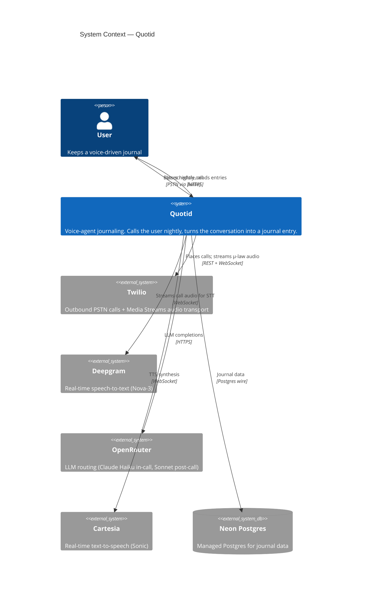

# C4 — System Context

Shows Quotid from 30,000 ft: one user, one product, and the external systems it integrates with.

## Design notes

- **LLM routing through OpenRouter, not direct Anthropic.** One key, one bill, multiple models behind a single base URL. Pipecat's `OpenAILLMService` targets OpenRouter's OpenAI-compatible endpoint; model is selected per call (`anthropic/claude-haiku-4-5` in-call for latency, `anthropic/claude-sonnet-4-6` post-call for summary quality).
- **Modal + WhisperX deliberately omitted.** The canonical-transcript path is designed-but-deferred (see Step 6). MVP uses Deepgram's real-time transcript as canonical. The `TranscriptProvider` interface in the Temporal workflow absorbs the future swap without diagram change.
- **Neon is shown as external** rather than bundled into the Quotid boundary because it's operationally independent (managed service, not a container we deploy).
