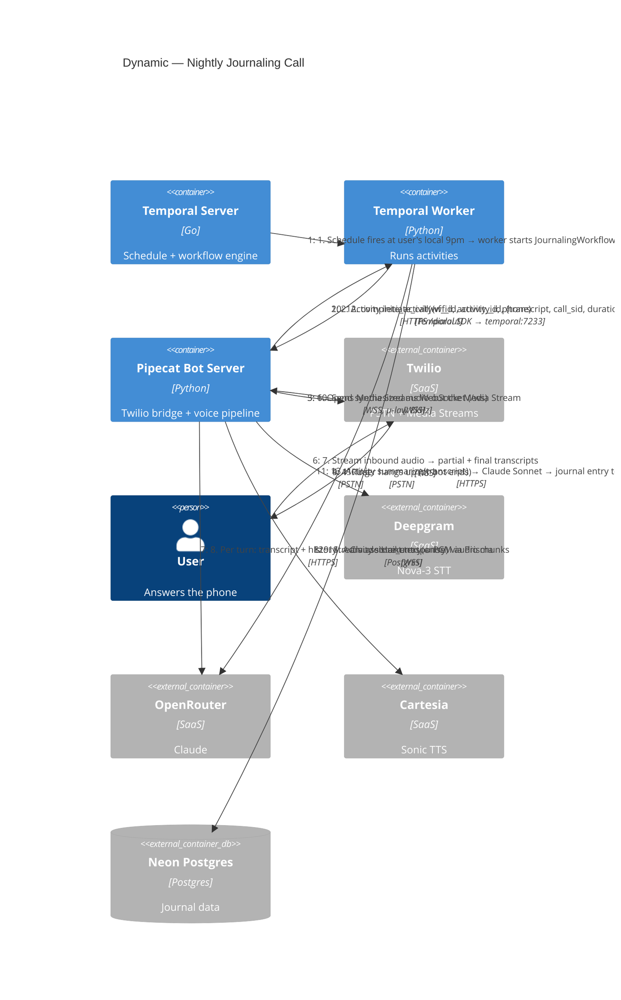

# C4 — Dynamic Diagram: Nightly Journaling Call

Traces one nightly call end-to-end, from the Temporal schedule firing to the journal entry landing in Neon.

## Design notes

### Handoff: Temporal ↔ Pipecat

The critical integration. Implemented as Temporal's **async activity completion** pattern:

1. Workflow starts `await_call` activity.
2. Inside the activity, the worker calls `activity.raise_complete_async()` after passing the `wf_id` + `activity_id` to Pipecat through the `/dialout` request body. The activity returns without completing — Temporal marks it as "waiting for external completion."
3. Pipecat runs the call. On `EndFrame` / `on_client_disconnected`, the bot code calls `temporal_client.get_async_activity_handle(workflow_id=wf_id, activity_id=activity_id).complete(payload)`.
4. The workflow resumes with the payload.

`start_to_close_timeout` on `await_call` = 20 minutes — backstop for runaway or crashed calls.

### Watchdog: Twilio statusCallback

In parallel with (12), Twilio fires a `statusCallback` HTTP POST to `/api/webhooks/twilio/status` in the Next.js app whenever a call transitions to `completed` / `failed` / `no-answer`. The webhook signals the workflow with the outcome. If Pipecat crashed and never sent (12), the statusCallback lets the workflow fail the activity cleanly and branch to "missed call."

### What's NOT in this diagram (deliberately)

- **Modal / WhisperX canonical transcript** — deferred. When added, step 13 gains a sibling activity `transcribe_canonical(call_recording_url)` that runs in parallel with `summarize`. The interface is already designed.
- **Web UI interactions** — covered separately. This diagram is the "call loop" only.
- **Retries** — activity-level retry policies are set but not shown. Transient network errors to OpenRouter/Deepgram/Cartesia/Twilio REST retry automatically; call-not-answered is a **workflow branch**, not an activity retry.

### Failure modes

| Failure | Handling |
|---|---|
| User doesn't pick up | Twilio reports `no-answer` via statusCallback → workflow branch: "missed" entry or reschedule |
| Twilio REST 5xx during `calls.create` | Activity-level retry with exponential backoff |
| Deepgram / OpenRouter / Cartesia blip mid-call | Pipecat surface the error; bot ends gracefully; activity completes with partial transcript; workflow still summarizes |
| Pipecat crash mid-call | Twilio statusCallback is the watchdog; `await_call` times out at 20 min → branch to "call failed" |
| Neon unreachable during `store_entry` | Activity-level retry; workflow does not lose the transcript (it's already in workflow state) |
